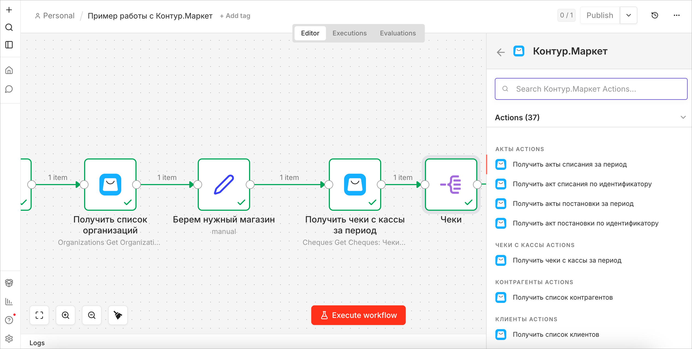

# n8n-nodes-kontur-market

Нода для интеграции **Контур.Маркет** с платформой автоматизации
**n8n**.\
Предоставляет удобный интерфейс для работы с API Маркета без ручной настройки HTTP‑запросов.\
Позволяет получать данные о товарах, остатках, продажах, клиентах и акциях, а также управлять товарами и остатками.

[Контур.Маркет](https://kontur.ru/market) — облачный сервис для автоматизации торговли и общепита: касса, товароучёт, маркировка, ЕГАИС и «Меркурий» в одном окне.

[n8n](https://n8n.io/) — это платформа автоматизации рабочих процессов.



------------------------------------------------------------------------

# Установка

## Community Nodes (рекомендуемый способ)

1.  Перейдите в **Settings → Community Nodes**
2.  Нажмите **Install**
3.  В поле **npm package name** введите: `n8n-nodes-kontur-market`
4.  Подтвердите установку community nodes, поставив галочку **I understand the risks of installing unverified code from a public source**
5.  Нажмите **Install**

------------------------------------------------------------------------

## Ручная установка

Установите пакет в корневой директории n8n:

``` bash
npm install n8n-nodes-kontur-market
```

------------------------------------------------------------------------

# Авторизация

Чтобы работать с нодой, необходимо выпустить **API‑ключ в
Контур.Маркет**, а затем добавить его в **Credentials n8n**.

Чтобы выпустить ключ, воспользуйтесь инструкцией:
**[Как выпустить API‑ключ для Контур.Маркет](https://support.kontur.ru/market/39530-integraciya_s_pomoshhyu_api#1)**

## Добавление API ключа в n8n

1.  Откройте n8n и перейдите в рездел **Credentials**
2.  Нажмите **Add Credential**
3.  Выберите Credential для **Контур.Маркет**
4.  Вставьте API‑ключ в поле **API key**
5.  Нажмите **Save**

Если всё настроено правильно, появится сообщение `Connection tested successfully`

# Полезные ссылки

- [Техническая документация API Контур.Маркет](https://developer.kontur.ru/doc/market.public)
- [Справочная информация по API Контур.Маркет (выпуск ключа, поддержка и др.)](https://support.kontur.ru/market/39530-integraciya_s_pomoshhyu_api)
- [Документация по установке community nodes n8n](https://docs.n8n.io/integrations/community-nodes/installation/)
- [Руководство по self-hosted установке n8n](https://docs.n8n.io/hosting/)

------------------------------------------------------------------------

# Возможности

## Организации и торговые точки

-   Получить список организаций
-   Получить список торговых точек
-   Получить торговую точку по идентификатору

## Чеки с кассы

-   Получить чеки с кассы за период

## Товары, услуги и блюда

-   Получить список товаров
-   Получить товар по идентификатору
-   Создать товар или услугу
-   Создать блюдо (техкарту)
-   Изменить товар, услугу или блюдо
-   Передать каталог товаров на кассы

## Контрагенты

-   Получить список контрагентов

## Клиенты

-   Получить список клиентов
-   Получить клиента по идентификатору

## Группы каталога товаров

-   Получить список групп
-   Получить группу по идентификатору

## Остатки товаров
-   Получить текущие остатки товаров
-   Изменить остатки товаров

## Акты

-   Получить акты списания за период
-   Получить акт списания по идентификатору
-   Получить акты постановки за период
-   Получить акт постановки по идентификатору

## Накладные

-   Получить входящие накладные за период
-   Получить входящую накладную по идентификатору
-   Получить расходные накладные за период
-   Получить расходную накладную по идентификатору

## Акции

-   Получить список акций

## Акцизные марки

-   Получить список акцизных марок
-   Получить состояние акцизной марки

## Очередь акцизных марок

-   Добавить акцизную марку в очередь списания
-   Забронировать объем акцизной марки
-   Отменить бронирование марки
-   Массово отменить бронирование марок
-   Зарегистрировать продажу чистой порции алкоголя
-   Зарегистрировать продажу коктейля

## Журнал учета продаж

-   Добавить или обновить записи журнала продаж

## Чеки в УТМ

-   Зарегистрировать чек продажи или возврата

------------------------------------------------------------------------

# Операции изменения данных

Нода поддерживает операции изменения данных в системе Контур.Маркет:

-   Создание товаров, услуг и блюд
-   Обновление товаров
-   Изменение остатков товаров
-   Передача каталога товаров на кассы
-   Добавление данных в журнал продаж
-   Работа с очередью акцизных марок
-   Регистрация чеков в УТМ

------------------------------------------------------------------------

# Быстрый старт

## Добавьте Credential

1. Выпустите API‑ключ Контур.Маркет
2. Добавьте Credential для ноды **Контур.Маркет**
3. Вставьте API‑ключ и сохраните

## Получите список организаций

1. Добавьте ноду **Контур.Маркет** в workflow
2. Выберите действие `Получить список организаций`
3. Запустите workflow

В результате вы получите список организаций и их торговых точек из Контур.Маркет.

------------------------------------------------------------------------

# Разработка

Для разработки используйте только исходники в корне репозитория:

- `nodes/`
- `credentials/`
- `dist/` как результат сборки

Стандартный запуск:

``` bash
npm run dev
```

Если dev-окружение `n8n-node dev` застряло, очистите его и запустите заново:

``` bash
npm run dev:reset
```
